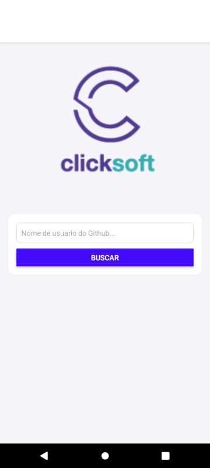
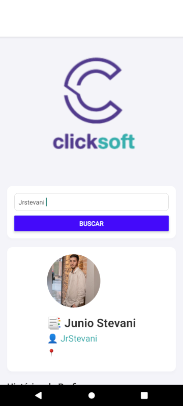

<h1>Descrição do Aplicativo de Pesquisa de Perfis GitHub</h1>

<h2>Visão Geral</h2>

O aplicativo de pesquisa de perfis GitHub é uma ferramenta que permite explorar informações detalhadas sobre desenvolvedores no GitHub. Com uma interface moderna e amigável, o app facilita a busca de perfis e a visualização de repositórios, oferecendo uma experiência completa e agradável.

</img>

<h2>Funcionalidades Principais</h2>
<ul>
    <li><strong>Busca Rápida e Precisa:</strong> A tela principal do aplicativo permite buscar perfis do GitHub digitando o nome de usuário. Os resultados exibem a foto, nome, login e localização do usuário pesquisado, tornando a busca mais eficiente.</li>
    <li>
        
    </li>
    <li><strong>Perfil Detalhado:</strong> Ao clicar na foto do perfil de um usuário, o app abre uma página detalhada com informações abrangentes, incluindo:
        <ul>
            <li>Foto do perfil</li>
            <li>Nome completo</li>
            <li>Login do GitHub</li>
            <li>Localização</li>
            <li>ID do usuário</li>
            <li>Quantidade de seguidores</li>
            <li>Quantidade de repositórios públicos</li>
            <li>Lista completa de repositórios do usuário, com detalhes como nome, linguagem, descrição, data de criação e data do último push.</li>
        </ul>
    </li>
    
    <li><strong>Navegação para Repositórios:</strong> Acesse facilmente qualquer repositório clicando no nome do repositório na lista de repositórios. O aplicativo redireciona o usuário para a página do repositório no site do GitHub.</li>
    <li><strong>Menu de Recentes:</strong> O menu de usuários pesquisados recentemente exibe todos os perfis pesquisados anteriormente, com informações similares à tela principal. Isso facilita o acesso rápido a perfis que o usuário visitou anteriormente.</li>
</ul>

<h2>Tecnologias Utilizadas</h2>
<ul>
    <li><strong>React Native (Expo):</strong> Framework escolhido para o desenvolvimento do aplicativo, permitindo a criação de aplicativos móveis nativos com uma única base de código.</li>
    <li><strong>TypeScript:</strong> Utilizado para garantir um desenvolvimento mais seguro e com menos erros, aproveitando o sistema de tipos estáticos.</li>
    <li><strong>Axios:</strong> Biblioteca para realizar requisições HTTP de maneira eficiente e confiável.</li>
    <li><strong>Styled-components:</strong> Ferramenta para estilização dos componentes, proporcionando um design modular e consistente.</li>
</ul>

<h2>Experiência do Usuário</h2>

O aplicativo foi desenvolvido com foco na experiência do usuário, oferecendo uma navegação fluida e um design intuitivo.

